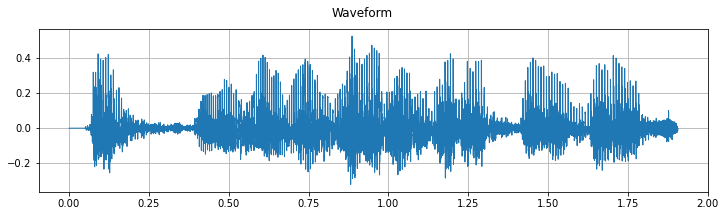
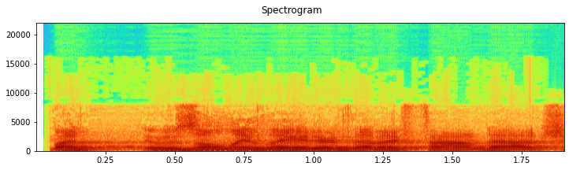
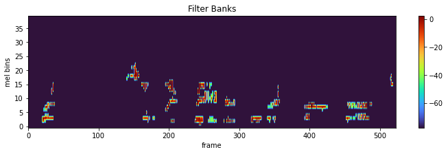
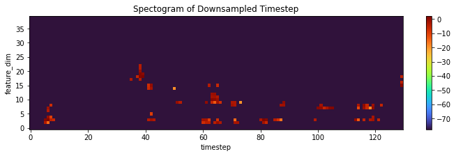

# End-to-end Automatic Speech Recognition Systems - PyTorch Implementation


## Dependencies
- Python 3
- Computing power (high-end GPU) and memory space (both RAM/GPU's RAM) is **extremely important** if you'd like to train your own model.
- Required packages and their use are listed [requirements.txt](requirements.txt).

---

## Dataset
Data is collected from the [Ted2srt webpage](https://ted2srt.org "Ted2srt Homepage").

Run `python3 scraper/preprocess.py` from root directory to scrape and generate dataset.
The script will:
1. Scrape data from website.
2. Preprocess the data.
3. Split the data to train-dev-test sets.

Scraped data is saved at `scraper/data/`, processed data will be saved to `data/`. Alternatively, download preprocessed data [here](https://nusu-my.sharepoint.com/:u:/g/personal/e0674581_u_nus_edu/EdCosjueRfVIm2kQK3RKBdYBrtlVWU8hsBzcjG7cb9Uo3w?e=fkWh09).


## Training
To train each model:

1. In the root directory, run the command `python3 main.py --config config/<dataset>/<config_file>.yaml --njobs 8`.

### Configuration Files
To use our dataset, set `<dataset>` as `ted` to use scraped data, or `libri` to use public data from [OpenSRL](https://www.openslr.org/12/).

Configuration files are stored as:

#### Train Extractors

| Extractor | Classifier | Configuration file |
|-----------|------------|--------------------|
| MLP       | RNN        | mlp_rnn.yaml       |
| CNN       | RNN        | cnn_rnn.yaml       |
| ANN       | RNN        | ann_rnn.yaml       |
| RNN       | RNN        | rnn_rnn.yaml       |

#### Train Classifiers

| Extractor | Classifier | Configuration file |
|-----------|------------|--------------------|
| CNN       | MLP        | cnn_mlp.yaml       |
| CNN       | CNN        | cnn_cnn.yaml       |
| CNN       | ANN        | cnn_ann.yaml       |


## Experiment results
Experiment results are stored at [experiment_results.md](experiment_results.md).


## Model Architecture
<p align="center">
  
</p>

There are two main subcomponents. First is the extractor, the extractor further extracts the audio features for every frame into a latent representation $h$. Then we have the classifier, that takes in the latent representation, make prediction for each frame by classifying them into a predefined set of word token such as “a”, “the”, “-tion” etc. Lastly, the Beam search decoding algorithm decode the raw classification results into a sentence. A typical ASR has a CNN extractor and a RNN classifier.

<p align="center">
  
</p>

For our experimentation we firstly fix the classifier to be RNN, and compare how the 4 NN variants perform as the extractor.

<p align="center">
  
</p>

Secondly, we fix the Extractor to be CNN. and replace the classifier with the 4 NN variants.

---

## Implementation
### Data Preprocessing
Preprocess scraped data to input into `Dataset` and `DataLoader`. Includes data cleaning, cutting audio into multiple audio slices according to SRT annotated time and prepare label for each audio slice.

#### Data Preprocessing Inputs/Outputs
- Input from scraped audio files and SRT.
- Output preprocessed ready dataset for ASR.

#### Data Preprocessing Descriptions
Symbols are removed from label and converted to lowercase.

Data that are less accurate are removed. Checking done for SRT that starts at the same time (e.g. `00:00:12,820 --> 00:00:14,820`). SRT that does not include introduction music time is filtered. Laughter and applause is removed.

Raw SRT snippet
```
1
00:00:12,312 --> 00:00:14,493
Six months ago, I got an email

2
00:00:14,493 --> 00:00:15,900
from a man in Israel
```
converted to
```
<audio_id>-1 six months ago i got an email
<audio_id>-2 from a man in israel
```
and stored at `<audio_id>.trans.txt`. Corresponding sliced audio files are named `<audio_id>_<audio_index>.mp3`.

After `build_dataset()` has preprocessed the data, the data is split into  train-dev-test sets.


### Data Exploration

#### Audio metadata of an audio slice
```
Sample Rate: 44100
Shape: (1, 84055)
Dtype: torch.float32
 - Max:          0.523
 - Min:         -0.319
 - Mean:        -0.000
 - Std Dev:      0.081
 ```

#### Audio signal


Waveform plot of sample audio signal with length of 1.9s. Duration length can obtained: `signal_frames / sample_rate`.

#### Spectrogram of raw audio signal



### Data Processing
Steps to compute filter banks are motivated to mimic how human perceives audio signals<sup>[[1]](#reference)</sup>.

1. Apply pre-emphasis filter on audio signal (amplify the high frequencies since high frequencies have smaller magnitude).
2. Cut signal into window frames (assume signal is stationary over a short period time).
3. Compute the power spectrum of the signal (Fourier transform) for each window.


Kaldi filter banks transformation applied on audio signals. 40 mel coefficients is kept.
``` python
feat_dim = 40
waveform_trans = torchaudio.compliance.kaldi.fbank(signal, frame_length=25, frame_shift=10, num_mel_bins=feat_dim)
plot_spectrogram(waveform_trans.transpose(0, 1).detach(), title="Filter Banks", ylabel='mel bins')
```



### Extractors
Extractor generates a sequence of feature vectors. Each feature vector is extracted from a small overlapped window of audio frames. Extractor transforms $x$, to high-level representation $h = (h_1, ..., h_L)$.

Extractor includes downsampling of timesteps.



For example downsampling by a factor of 4 from 523 timesteps to 130 timesteps in RNN extractor. Downsampling is also achieved by MaxPooling of CNN extractors.

### Classifiers

Classifier generates an output sequence $(y_1, . . . , y_T)$ from input $h$. $h$ is the output of the extractor. The classifier's output $y$ is a sequence of word tokens. The sequence $y$ is expected to include a dimension of the same size as $h$.


## Featured Notebook
* [Notebook](project_group40_notebook.ipynb)


---

Original README can be accessed [here](https://github.com/Alexander-H-Liu/End-to-end-ASR-Pytorch/blob/master/README.md).


## Module Code: **CS5242** 

### Semester: AY2021-22 Sem 1
### Group 40
- Liu Shiru (A0187939A)
- Lim Yu Rong, Samuel (A0183921A)
- Yee Xun Wei (A0228597L)


## Reference

1. Liu, A., Lee, H.-Y., & Lee, L.-S. (2019). Adversarial Training of End-to-end Speech Recognition Using a Criticizing Language Model. Acoustics, Speech and Signal Processing (ICASSP). IEEE.

2. Liu, A. H., Sung, T.-W., Chuang, S.-P., Lee, H.-Y., & Lee, L.-S. (2019). Sequence-to-sequence Automatic Speech Recognition with Word Embedding Regularization and Fused Decoding. arXiv [cs.CL]. Opgehaal van http://arxiv.org/abs/1910.12740
