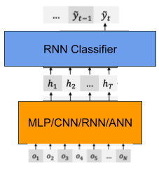
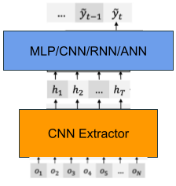

# End-to-end Automatic Speech Recognition Systems - PyTorch Implementation

### Module Code: **CS5242** 

#### Semester: AY2021-22 Sem 1
#### Group 40
- Liu Shiru (A0187939A)
- Lim Yu Rong, Samuel (A0183921A)
- Yee Xun Wei (A0228597L)

## Dependencies

- Python 3
- Computing power (high-end GPU) and memory space (both RAM/GPU's RAM) is **extremely important** if you'd like to train your own model.
- Required packages and their use are listed [requirements.txt](requirements.txt).

## Dataset

Data is collected from the [Ted2srt webpage](https://ted2srt.org "Ted2srt Homepage").

Run `python3 scraper/preprocess.py` from root directory to scrape and generate dataset.
The script will:
1. Scrape data from website.
2. Preprocess the data.
3. Split the data to train-dev-test sets.

Scraped data is saved at `scraper/data/`, processed data will be saved to `data/`.

## Training

To train each model:

1. In the root directory, run the command `python3 main.py --config config/<dataset>/<config_file>.yaml --njobs 8`.

### Configuration Files

To use our dataset, set `<dataset>` as `ted` to use scraped data, or `libri` to use public data from [OpenSRL](https://www.openslr.org/12/).

Configuration files are stored as:

#### Train Extractors

| Extractor | Classifier | Configuration file |
|-----------|------------|--------------------|
| MLP       | RNN        | mlp_rnn.yaml       |
| CNN       | RNN        | cnn_rnn.yaml       |
| ANN       | RNN        | ann_rnn.yaml       |
| RNN       | RNN        | rnn_rnn.yaml       |

#### Train Classifiers

| Extractor | Classifier | Configuration file |
|-----------|------------|--------------------|
| CNN       | MLP        | cnn_mlp.yaml       |
| CNN       | CNN        | cnn_cnn.yaml       |
| CNN       | ANN        | cnn_ann.yaml       |

## Experiment results

Experiment results are stored at [experiment_results.md](experiment_results.md).

## Model Architecture

  

There are two main subcomponents. First is the extractor, the extractor further extracts the audio features for every frame into a latent representation $h$. Then we have the classifier, that takes in the latent representation, make prediction for each frame by classifying them into a predefined set of word token such as “a”, “the”, “-tion” etc. Lastly, the Beam search decoding algorithm decode the raw classification results into a sentence. A typical ASR has a CNN extractor and a RNN classifier.

  

For our experimentation we firstly fix the classifier to be RNN, and compare how the 4 NN variants perform as the extractor.

  

Secondly, we fix the Extractor to be CNN. and replace the classifier with the 4 NN variants.

---

Original README can be accessed [here](https://github.com/Alexander-H-Liu/End-to-end-ASR-Pytorch/blob/master/README.md).

## Reference

1. Liu, A., Lee, H.-Y., & Lee, L.-S. (2019). Adversarial Training of End-to-end Speech Recognition Using a Criticizing Language Model. Acoustics, Speech and Signal Processing (ICASSP). IEEE.

2. Liu, A. H., Sung, T.-W., Chuang, S.-P., Lee, H.-Y., & Lee, L.-S. (2019). Sequence-to-sequence Automatic Speech Recognition with Word Embedding Regularization and Fused Decoding. arXiv [cs.CL]. Opgehaal van http://arxiv.org/abs/1910.12740
