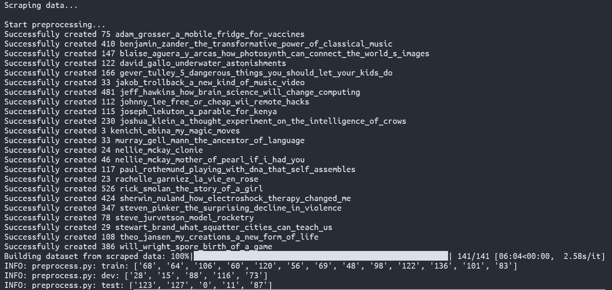
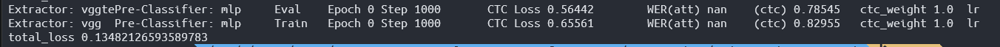

# Using TedSrt data

Run `python scraper/preprocess.py` to scrape and generate data. Raw data saved at `scraper/`, processed data at `data/`.

To train using TedSrt `python main.py --config config/ted/asr_example.yaml --njobs 8`.

- 141 /200 urls scraped
- 23 /140 scraped data converted to dataset

Try training 1000 steps. Configuration used stored at config/ted/asr_xw.yaml

